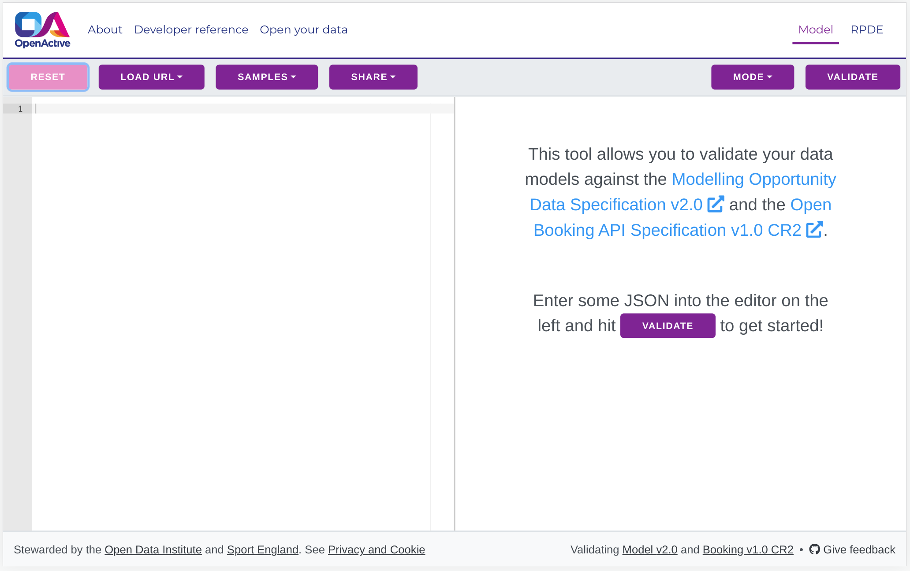

# Simple booking

This guide will explain how to implement an Open Booking API so that a Customer can create an order in your booking system, using the simple booking flow.

## Main roles

The simple booking flow involves 5 different roles:

#### Customer

The user who places a booking using an application provided by a [Broker](https://openactive.io/open-booking-api/EditorsDraft/1.0CR3/#dfn-broker). The [Customer](https://openactive.io/open-booking-api/EditorsDraft/1.0CR3/#dfn-customer) is not necessarily the attendee, e.g. a parent may book on behalf of their child.

#### Broker

The organisation, independent of the [Seller](https://openactive.io/open-booking-api/EditorsDraft/1.0CR3/#dfn-seller), that provides an application allowing [Customers](https://openactive.io/open-booking-api/EditorsDraft/1.0CR3/#dfn-customer) to make bookings. For simplicity the API client is referred to as the [Broker](https://openactive.io/open-booking-api/EditorsDraft/1.0CR3/#dfn-broker) throughout this specification, however other API clients are permissible, and "[Booking Partner](https://openactive.io/open-booking-api/EditorsDraft/1.0CR3/#dfn-booking-partner)" is the collective term for different types of clients of this API.

#### Booking System (you)

The organisation providing an application that maintains bookable inventory on behalf of the [Seller](https://openactive.io/open-booking-api/EditorsDraft/1.0CR3/#dfn-seller). The platform or service that provides a server-side implementation of this API.

#### Seller

The organisation providing access to events or facilities via a [Booking System](https://openactive.io/open-booking-api/EditorsDraft/1.0CR3/#dfn-booking-system) e.g. a leisure provider running yoga classes.

#### Payment Provider

The notional service providing payment processing between the [Customer](https://openactive.io/open-booking-api/EditorsDraft/1.0CR3/#dfn-customer), [Broker](https://openactive.io/open-booking-api/EditorsDraft/1.0CR3/#dfn-broker) and [Seller](https://openactive.io/open-booking-api/EditorsDraft/1.0CR3/#dfn-seller). Although this specification refers to the [Payment Provider](https://openactive.io/open-booking-api/EditorsDraft/1.0CR3/#dfn-payment-provider) as a single notional service, it may in reality be composed of multiple connected services providing the same functionality to allow for the widest variety of business models.

## Customer journey

A Customer can create a booking in three steps:

1. Select&#x20;
   * Choose an item to purchase
2. Identify
   * Submit personal details
3. Book and Pay
   * Submit payment details

These steps indicate the flow of information required to make a booking but they do not need to be presented customer (e.g. if personal details or payment details are already known).

