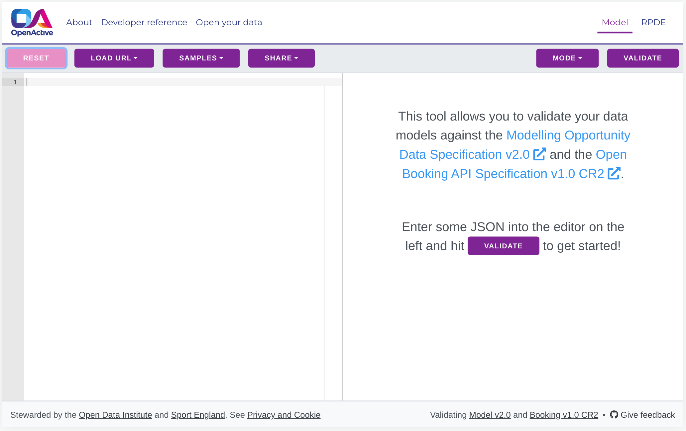

# Introduction

## Before getting stared

This guide will take you through how to create an Open Booking API for your booking system. Before creating your API you will need to have set up an [Open Opportunity Feed](../../required-features-guides/opportunity-feeds/) which enables external applications to view availability in your system.&#x20;

Once you are comfortable with your feed setup - you can get started.

## What is the Open Booking API for?

The Open Booking API is a collection of endpoints that enable other applications to make bookings in your system. Here's a high level overview of the actors and relationships between them.

#### Customer

The user who places a booking using an application provided by a Broker. The Customer is not necessarily the attendee, e.g. a parent may book on behalf of their child.

#### Broker

The organisation, independent of the Seller, that provides an application allowing Customers to make bookings.&#x20;

#### Booking System (you)

The organisation providing an application that maintains bookable inventory on behalf of the Seller. The platform or service that provides a server-side implementation of this API.

#### Seller

The organisation providing access to events or facilities via a Booking System e.g. a leisure provider running yoga classes.

#### Payment Provider

The notional service providing payment processing between the Customer, Broker and Seller. Although this specification refers to the Payment Provider as a single notional service, it may in reality be composed of multiple connected services providing the same functionality to allow for the widest variety of business models.

## What you are going to make

You are going to create endpoints that make up the Open Booking API. They will enable a customer to go through a journey that follows these three steps:

1. Select - Choose an item to purchase
2. Identify - Submit personal details
3. Book and Pay - Submit payment details

The endpoints will deal with all situations in the journey; abandonment, cancellation, errors as well as exposing orders that have been completed.

## Booking System Architecture

Whilst following this guide it will be helpful to hold in mind the type of architecture you are operating particularly whether your system supports multiple or single sellers.

??? WHAT IMPACT WILL THIS HAVE ON IMPLEMENTATION OF OPEN BOOKING API ???

* **Single Seller**: The booking system either supports a single Seller by design (e.g. an agency build for a specific organisation), or the booking system is designed to have a database provisioned for each customer (e.g. larger leisure management solutions deployed on-premise or cloud hosted).
* **Multiple Sellers**: The booking system is multi-tenancy within the same database, so for example multiple Sellers are able to log in and manage sessions and facilities within the same underlying database (e.g. a booking system targeting at a large number of small/medium size activity providers).

## Approach

This guide will take you through the implementation of the Open Booking API for your booking system. Each stage will take the following approach:

* Begin with a simple or previously understood concept
* Introduce a new concept or element for you to add into your implementation
* Walk you through the new implementation step-by-step
* Prompt you to validate and test
* Link you to the next concept needed

Helpful considerations will be flagged throughout the guide to help you decide how best to implement the API for your particular booking system.&#x20;

??? HOW TO REFER TO "THE API" IN PROSE ???

Let's get started with a more detailed look at the end points we will be creating.
