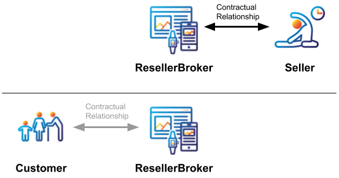

# Broker Roles

A Broker is an actor that arranges transactions between a Seller and Customer, either directly or indirectly.

From a contractual and taxation perspective, there are two types of Broker: agents (`AgentBroker`), and resellers (`ResellerBroker`). In addition, situations in which the customer contracts directly with the seller without a third party are represented by the `brokerRole` value of `NoBroker`.


The Open Booking API does not deal with contractual relationships, and simply provides a mechanism to record bookings


## ResellerBroker

### Definition

A reseller is a company or individual that purchases goods or services with the intention of selling them rather than consuming or using them. This is usually done for profit (but could be resold at a loss).

### Contractual relationship

In the context of OpenActive, a `ResellerBroker` contracts directly with the Seller as a business-to-business relationship to purchase access to the Opportunity. It then, at a later point in time (which may only be milliseconds later), separately forms a contractual relationship with the Customer, who purchases access to the Opportunity from the `ResellerBroker`.

### Taxation

The `ResellerBroker`'s purchase from the Seller is business-to-business, which is subject to the appropriate taxation based on the `ResellerBroker` as the Customer. The Customer's purchase from the `ResellerBroker` is business-to-consumer, which is subject to the appropriate taxation based on the `ResellerBroker` as the Seller.

Hence any tax exemption that the Customer may enjoy when purchasing directly from the Seller (e.g. in UK law, if the Seller is a VAT exempt eligible body) is not relevant here, as no direct contractual relationship is formed between Seller and Customer.

### Scope of Documentation

This documentation is designed to govern the interaction between the `ResellerBroker` and Seller. It does not include provision for the interaction between the `ResellerBroker` and Customer explicitly, though it may be repurposed by the Broker to perform this function by treating the Broker as a Booking System. This specification also does not include provision for the recording of the execution of the contractual relationship with any Payment Provider (e.g. for payment processing fees). Such relationships _must_ be handled separately. When the `brokerRole` is set to `ResellerBroker`, this indicates that the payee for accounting and tax purposes is the `broker` specified in the `Order`. Note that the `customer` may still optionally be included in the Order, for example to help front-of-house staff identify the Customer.

### Conformance criteria

When the Broker generates the Invoice, it must be made payable to `Order.broker`, `Order.broker` **must** be provided and `Order.customer` is optional.\

## AgentBroker

### **Definition**

An agent is authorized to act on behalf of another (the Seller, or "principal") to create legal relations with a third party (the Customer). Succinctly, it may be referred to as the equal relationship between a Seller and an agent whereby the principal, expressly or implicitly, authorizes the agent to work under his or her control and on his or her behalf. The agent is required to negotiate on behalf of the principal (Seller) and/or bring them and third parties (Customers) into contractual relationship.

### **Contractual Relationships**

There are three separate types of contractual relationship involved: `AgentBroker` with Seller, known as the principal-agent relationship or "internal" relationship; `AgentBroker` with Customer with whom they deal on their Seller's behalf ("external relationship"); and Seller with Customer when arranged by an `AgentBroker`.

### **Taxation**

While facilitated by the `AgentBroker`, the primary purchase is made by the Customer directly from the Seller, as would be the case if the Customer was to purchase from the Seller independently. Hence any tax exemption that the Customer may enjoy when purchasing directly from the Seller (e.g. in UK law, if the Seller is an VAT exempt eligible body) is relevant here.

The Customer's relationship with `AgentBroker` is business-to-consumer. Hence any additional services (e.g. customer-facing booking fees) are subject to the appropriate taxation based on the `AgentBroker` as the `seller`.

The `AgentBroker`'s relationship with the Seller is business-to-business. Hence any additional services (e.g. booking commission) are subject to the appropriate taxation.

### **Scope of Specification**

This specification is designed to govern the recording of the execution of the contractual relationship between the Customer and Seller. The scope of this specification does not include the contractual relationship between the `AgentBroker` and the Seller (e.g. for booking commission), between the `AgentBroker` and the Customer (e.g. for booking fees) or with any Payment Provider (e.g. for payment processing fees). Such relationships and the reconciliation of associated invoices _must_ be handled separately. When the `brokerRole` is set to `AgentBroker`, this indicates that the payee for accounting and tax purposes is the `customer` specified in the `Order`.

### **Conformance criteria**

When the Broker generates the Invoice, it must be made payable to `Order.customer`, `Order.broker` _must_ be provided and `Order.customer` _must_ be provided.

### **Informed purchase**

When using a `brokerRole` of `AgentBroker`, the Broker _must_ make the Customer aware that they are purchasing directly from the Seller via the Broker, and not directly from the Broker.

## NoBroker

### **Definition**

This specification supports direct purchase by a Customer (for example in the context of the Seller's own website, or for businesses that purchase large volumes of FacilityUse slots to run leagues).

### **Contractual Relationships**

The contractual relationship is a simple one between the Seller and the Customer.

### **Taxation**

The purchase is made by the Customer directly from the Seller, as would be the case if the Customer was to purchase from the Seller outside of this specification. Hence any tax exemption that the Customer may enjoy when purchasing directly from the Seller (e.g. in UK law, if the Seller is an VAT exempt eligible body) is relevant here.

### **Scope of Specification**

This specification is designed to govern the recording of the execution of the contractual relationship between the Customer and Seller. The scope of this specification does not include the contractual relationship with any Payment Provider (e.g. for payment processing fees). Such relationships _must_ be handled separately.

When the `brokerRole` is set to `NoBroker`, this indicates that the payee for accounting and tax purposes is the `customer` specified in the `Order`.

### **Conformance criteria**

When an Invoice is generated, it must be made payable to `Order.customer`, `Order.broker` _must not_ be provided and `Order.customer` _must_ be provided.
